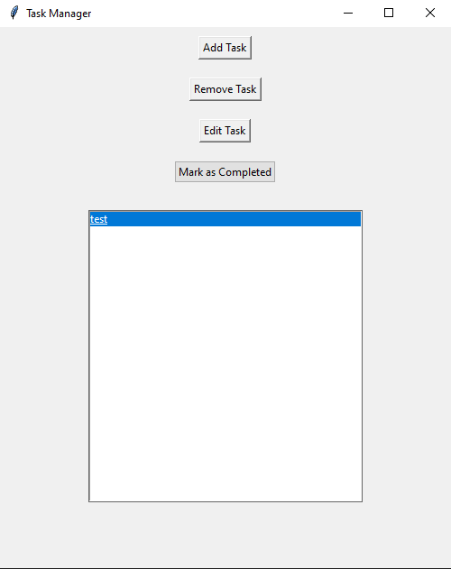
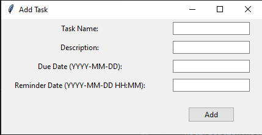

# TaskManager

A simple and efficient task management application built using `tkinter` for the GUI, JSON for task storage, and `plyer` for reminders.

## Features

- **Task Management**: Add, remove, and edit tasks.
- **Reminders**: Set reminders for tasks, and get desktop notifications.
- **Persistent Storage**: Tasks are saved to a JSON file, ensuring data persistence.
- **Task Status**: Mark tasks as completed.

## Screenshots

## Setup & Installation

1. Clone the repository:git clone https://github.com/your_username/TaskManager.git
2. Navigate to the project directory and install the required libraries:
3. Run the `mainUI.py`:

## Contribute

Contributions are welcome! If you have a feature request, bug report, or a new idea, feel free to open an issue or submit a pull request.

## License

MIT License. See [LICENSE](LICENSE) for more information.

